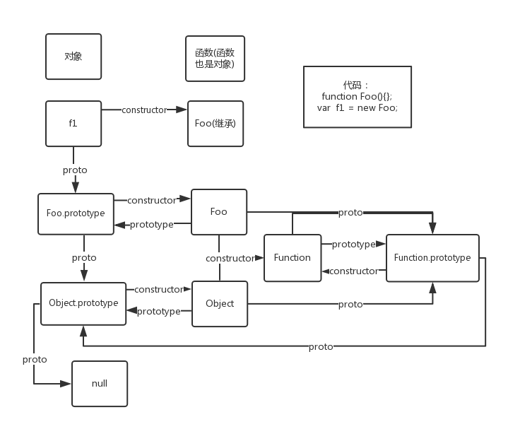

## 深入了解JavaScript中的prototype和\_\_proto\_\_

#### Js的基本类型和引用类型
js中可以把变量分为两部分，基本类型和引用类型。

* 基本类型：Undefined、Null、Boolean、Number和String。
> 这五种基本数据类型可以直接操作保存在变量中的实际值，这些变量是存放在栈区的（栈区指内存里的栈内存）

假如有以下几个基本类型的变量：

```js
 var name = 'kingbora';
 var city = 'hunan';
 var age = 21;
```

那么它的存储结构如下图：


* 引用类型：除了上述的五种基本类型之外其他的都是引用类型，也可以说是对象。对象是属性和方法的集合。
> 引用类型的值是同时保存在栈内存和堆内存中的对象，而栈区内存保存的是变量的标识符和指向堆区内存中该对象的指针，也就是该对象在堆内存的地址

假如有以下几个对象：

```js
 var person1 = {name:'Kingbora'};
 var person2 = {name:'John'};
 var person3 = [12,'Michael',person2];
```

那么它的存储结构如下图：


#### prototype
上面只是一个题外话，下面开始进入我们的主角prototype（基础定义这里就不细讲了）。看下面的例子：

```js
function a() {
	this.name = "kingbora";
}
console.log(a.prototype);
a.tag = 123;
console.log(a.prototype);
```

两个输出结果相同如下图：


可以看出，方法a中的name并没有出现，name只有在实例化的时候才会出现在constructor中

```js
function a() {
 this.name = "kingbora";
}
console.log(a.prototype);
a.tag = 123;
console.log(a.prototype);
a.prototype.tag = 345;
console.log(a.prototype);
```

结果如下：


由此可知道，在a上直接赋值是被放置在constructor之中的，而通过prototype赋值是放在prototype之中的，那么当a实例化之后又是怎样的结果呢？添加代码如下：

```js
function a(){
 this.tag = "kingbora";
}
a.tag = "john";
a.prototype.tag = "Michael";
var b = new a();
console.log(b);
```


可以看出在new之后，a.tag是直接赋值到了constructor中，不会传给它的实例对象，所以在实例对象b中是无法访问到的，而a.prototype.tag会放置在b这个实例对象的原型之上，其原型即为a。可参照如下去理解new这个关键字做了些什么



总结:

* this.tag：只有在被实例化之后才会出现，被放置在实例对象上
* a.tag：a函数的静态变量，被放置在a函数本身，即位于a函数的constructor之中，不能被继承
* a.prototype.tag：存在于a的prototype之中,当被实例化的时候会被继承到b实例的\_\_proto\_\_之下
* 实例对象本身没有constructor属性，但由于实例对象可以继承原型对象的属性，所以实例对象也拥有constructor属性，同样指向原型对象对应的构造函数
