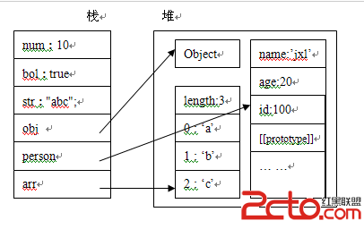

### 一、垃圾回收机制-GC
原理：垃圾收集器会定期（周期性）找出那些不再继续使用的变量，然后释放其内存。

#### 变量的生命周期
不再使用的变量也就是生命周期结束的变量，当然只可能是局部变量，全局变量的生命周期直至浏览器卸载页面才会结束。局部变量只在函数的执行过程中存在，而在这个过程中会为局部变量在栈或堆上分配相应的空间，以存储它们的值，然后再函数中使用这些变量，直至函数结束`闭包中由于内部函数的原因，外部函数并不能算是结束`

#### 内存分配
javascript中的变量分为两种，原始值和引用值。原始值指的是原始数据类型的值，比如undefined,null,number,string,boolean类型所表示的值。引用值指的是复合数据类型的值，即Object,Function,Array等。

原始值和引用值在内存中的位置分别是栈和堆。原始值是存储在栈中的简单数据段，他们的值直接存储在变量访问的位置。引用值是存储在堆中的对象。

存储在栈中的值是一个指针，指向存储在堆中的实际对象。

```js
function Person(id,name,age){ 
  this.id = id; 
  this.name = name; 
  this.age = age; 
} 
var num = 10; 
var bol = true; 
var str = "abc"; 
var obj = new Object(); 
var arr = ['a','b','c']; 
var person = new Person(100,"jxl",22);
```


由上图可知我们无法直接操作存储在堆中的数据，但是我们可以通过栈中的引用来操作对象。那么为什么要分开呢？不都是存储在内存中吗？

栈的优势就是存取速度比堆要快，仅次于直接位于CPU中的寄存器，但缺点是，存在栈中的数据大小与生存期必须是确定的，缺乏灵活性。堆的优势是可以动态地分配内存大小，生存期也不必事先告诉编译器，垃圾收集器会自动地收走这些不再使用的数据，但是缺点是由于在运行时动态分配内存，所以存取速度较慢。

所以相对于简单数据类型而言，他们占用内存比较小，如果放在堆中，查找会浪费很多时间，而把堆中的数据放入栈中也会影响栈的效率。比如对象和数组是可以无限拓展的，正好放在可以动态分配大小的堆中。

### 二、标记清除机制
js中最常用的垃圾回收方式就是标记清除。当变量进入环境时，例如，在函数中声明一个变量，就将这个变量标记为“进入环境”。从逻辑上讲，永远不能释放进入环境的变量所占用的内存，因为只要执行流进入相应的环境，就可能会用到它们。而当变量离开环境时，则将其标记为“离开环境”。

```js
function test(){
 var a = 10 ; //被标记 ，进入环境 
 var b = 20 ; //被标记 ，进入环境
}
test(); //执行完毕 之后 a、b又被标记离开环境，被回收。
```
到目前为止，IE、Firefox、Opera、Chrome、Safari的js实现使用的都是标记清除的垃圾回收策略或类似的策略，只不过垃圾收集的时间间隔互不相同。

### 三、引用计数机制
引用计数的含义是跟踪记录每个值被引用的次数。当声明了一个变量并将一个引用类型值赋给该变量时，则这个值的引用次数就是1。如果同一个值又被赋给另一个变量，则该值的引用次数加1。相反，如果包含对这个值引用的变量又取得了另外一个值，则这个值的引用次数减1。当这个值的引用次数变成0时，则说明没有办法再访问这个值了，因而就可以将其占用的内存空间回收回来。这样，当垃圾回收器下次再运行时，它就会释放那些引用次数为0的值所占用的内存。

```js
function test(){
 var a = {} ; //a的引用次数为0 
 var b = a ; //a的引用次数加1，为1 
 var c =a; //a的引用次数再加1，为2
 var b ={}; //a的引用次数减1，为1
}
```
但当出现循环引用的时候就会出现严重的内存泄漏问题。循环引用指的是对象A中包含一个指向对象B的指针，而对象B中也包含一个指向对象A的引用。
```js
function fn() {
 var a = {};
 var b = {};
 a.pro = b;
 b.pro = a;
}
 
fn();
```
以上代码a和b的引用次数都是2，fn()执行完毕后，两个对象都已经离开环境，在标记清除方式下是没有问题的，但是在引用计数策略下，因为a和b的引用次数不为0，所以不会被垃圾回收器回收内存，如果fn函数被大量调用，就会造成内存泄露。在IE7与IE8上，内存直线上升。

### 四、减少js垃圾回收
首先，最明显的，new关键字就意味着一次内存分配，例如 new Foo()。最好的处理方法是：在初始化的时候新建对象，然后在后续过程中尽量多的重用这些创建好的对象。

另外还有以下三种内存分配表达式（可能不像new关键字那么明显了）：

* {} （创建一个新对象）
* [] （创建一个新数组）
* function() {…} (创建一个新的方法，注意：新建方法也会导致垃圾收集！！)

#### 1、对象object优化
为了最大限度的实现对象的重用，应该像避使用new语句一样避免使用{}来新建对象。

{“foo”:”bar”}这种方式新建的带属性的对象，常常作为方法的返回值来使用，可是这将会导致过多的内存创建，因此最好的解决办法是：每一次函数调用完成之后，将需要返回的数据放入一个全局的对象中，并返回此全局对象。如果使用这种方式，就意味着每一次方法调用都会导致全局对象内容的修改，这有可能会导致错误的发生。因此，一定要对此全局对象的使用进行详细的注释和说明。

有一种方式能够保证对象（确保对象prototype上没有属性）的重复利用，那就是遍历此对象的所有属性，并逐个删除，最终将对象清理为一个空对象。

cr.wipe(obj)方法就是为此功能而生，代码如下：
```js
// 删除obj对象的所有属性，高效的将obj转化为一个崭新的对象！
cr.wipe = function (obj) {
  for (var p in obj) {
    if (obj.hasOwnProperty(p))
      delete obj[p];
  }
};
```
有些时候，你可以使用cr.wipe(obj)方法清理对象，再为obj添加新的属性，就可以达到重复利用对象的目的。虽然通过清空一个对象来获取“新对象”的做法，比简单的通过{}来创建对象要耗时一些，但是在实时性要求很高的代码中，这一点短暂的时间消耗，将会有效的减少垃圾堆积，并且最终避免垃圾回收暂停，这是非常值得的！
#### 2、数组array优化
将[]赋值给一个数组对象，是清空数组的捷径（例如： arr = [];），但是需要注意的是，这种方式又创建了一个新的空对象，并且将原来的数组对象变成了一小片内存垃圾！实际上，将数组长度赋值为0（arr.length = 0）也能达到清空数组的目的，并且同时能实现数组重用，减少内存垃圾的产生。
#### 3、方法function优化
方法一般都是在初始化的时候创建，并且此后很少在运行时进行动态内存分配，这就使得导致内存垃圾产生的方法，找起来就不是那么容易了。但是从另一角度来说，这更便于我们寻找了，因为只要是动态创建方法的地方，就有可能产生内存垃圾。例如：将方法作为返回值，就是一个动态创建方法的实例。

在游戏的主循环中，setTimeout或requestAnimationFrame来调用一个成员方法是很常见的，例如：
```js
setTimeout(
 (function(self) {                    
   return function () {
    self.tick();
 };
})(this), 16)
```
每一次调用都返回了一个新的方法对象，这就导致了大量的方法对象垃圾！为了解决这个问题，可以将作为返回值的方法保存起来，例如：
```js
// at startup
this.tickFunc = (
 function(self) {
  return function() {
   self.tick();
  };
 }
)(this);

// in the tick() function
setTimeout(this.tickFunc, 16);
```
相比于每次都新建一个方法对象，这种方式在每一帧当中重用了相同的方法对象。这种方式的优势是显而易见的，而这种思想也可以应用在任何以方法为返回值或者在运行时创建方法的情况当中。