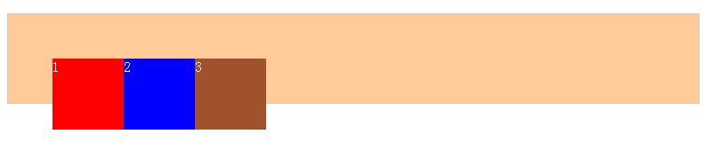
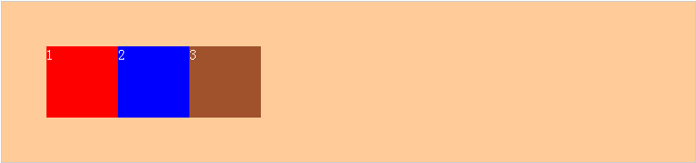

### <span style="color:red;">浏览器渲染</span>
在从服务器中拿到数据之后，浏览器会先解析三类东西：

* 解析html，xhtml，svg这三类文档，形成dom树
* 解析css，产生css rule tree
* 解析js，js会通过api来操作dom tree和css rule tree

解析完成之后，浏览器引擎会通过dom tree和css rule tree来构建rendering tree：

* rendering tree和dom tree并不完全相同，例如：<head></head>或者display:none的东西就不会放在渲染树中
* css rule tree主要是完成匹配，并把css rule附加给rendering tree的每个element

在渲染树构建完成之后，

* 浏览器会对这些元素进行定位和布局，这一步也叫reflow或者layout
* 浏览器绘制这些元素的样式，颜色，背景，大小及边框等，这一步也叫做repaint
* 然后浏览器会将各层信息发送到GPU，GPU会将各层合成，显示在屏幕上

之后浏览器要做的操作：
reflow--> repaint --> composite

> reflow和repaint都是耗费浏览器性能的操作，这两种尤以reflow为甚，因为每次reflow，浏览器都要重新计算每个元素的形状和位置
> 
> 由于reflow和repaint都是非常消耗性能的，我们的浏览器为此做了一些优化，浏览器会将reflow和repaint的操作积攒一批，然后做一次reflow。但是有的时候所写的代码可能会强制浏览器做多次reflow。

优化实践方案：

* 不要一条一条地修改dom样式，尽量使用className一次修改
* 将dom离线后修改
	* 使用documentFragment对象在内存里操作dom
	* 先把dom节点display:none;（会触发一次reflow）。然后做大量的修改后，再把它显示出来。
	* clone一个dom节点在内存中，修改之后与在线的节点相替换
* 不要使用table布局，一个小改动会造成整个table的重新布局
* transform和opacity只会引起合成，不会引起布局和重绘
* 为了仅发生composite，我们做动画的css property必须满足以下三个条件（满足以下条件的只有transform和opacity）：
	* 不影响文档流
	* 不依赖文档流
	* 不会造成重绘

### <span style="color:red;">关于css清除浮动的思考</span>
在学习css中遇到过很多问题，这些问题的产生会让我们感到不明所以，而今天所要研究的关于css清除浮动，便是其中的一个比较模糊的问题。

经常会在一些网站中看到清除浮动的方法，如clear:both;如何不加这个就会造成页面混乱，但是加上之后就会呈现完美效果，这也是清除浮动的一个魅力所在。

首先呢，我们得明白页面中的浮动是如何产生的，它这样写为何会造成浮动呢？下面我们就开始举例子一一道明原由。

html文件:

```html
<div class="outer">
	<div class="div div1">1</div>
	<div class="div div2">2</div>
	<div class="div div3">3</div>
</div>
```
css样式：

```css
.div {
	float: left;
	width: 80px;
	height: 80px;
}
.outer{
	border: 1px solid #ccc;
	background: #fc9;
	color: #fff; 
	margin: 50px auto;
	padding: 50px;
}
.div1{
	background: red;
}
.div2{
	background: blue;
}
.div3{
	background: sienna;
}
```

看结果这一定不是我们所想要的：



解决方法一：添加新元素，在新元素上应用clear:both;

HTML:

```html
<div class="outer">
	<div class="div div1">1</div>
	<div class="div div2">2</div>
	<div class="div div3">3</div>
	<div class="clear"></div> <!-- 这里添加一个新元素 -->
</div>
```

CSS:

```css
.clear {
	clear: both;
}
```



方法二：父级div定义overflow:auto

HTML:

```html
<div class="outer over-flow"> <!-- 这里添加一个新class -->
	<div class="div div1">1</div>
	<div class="div div2">2</div>
	<div class="div div3">3</div>
</div>
```

CSS:

```css
.over-flow {
	overflow: auto;
	zoom: 1; //用于处理兼容性问题
}
```

方法三：在父级添加:after,应用clear:both;

HTML:

```html
<div class="outer">
	<div class="div div1">1</div>
	<div class="div div2">2</div>
	<div class="div div3">3</div>
</div>
```

CSS:

```css
.outer {
	zoom: 1; //处理兼容性问题
}
.outer:after {
	content: '';
	display: block;
	clear: both;
	visibility: hidden;
}
```

总结：当一个内层元素是浮动的时候，如果没有关闭浮动时，其父元素也就不会再包含这个浮动的内层元素，因为此时浮动元素已经脱离了文档流。也就是为什么外层不能被撑开了

精简代码：

```css
.clearfix:after {
	content: '';
	display: block;
	height: 0;
	visibility: hidden;
	clear: both;
}
.clearfix {
	*zoom: 1;
}
```

知识储备：

css中的定位机制：普通流、浮动、绝对定位（其中"position:fixed"是"position:absolute"的一个子类）。

* 普通流：DOM文档按照正常进行布局
* 浮动：浮动的框可以左右移动，直到它的外边缘遇到包含框或者另外一个浮动框的边缘。浮动框不属于文档中的普通流，当一个元素浮动之后，不会影响到块级框的布局而只会影响內联框（通常是文本）的排列，文档中的普通流就会表现得和浮动框不存在一样，当浮动框高于包含框是，就会出现包含框不会自动伸高来闭合浮动元素（“高度塌陷”现象）。顾名思义，就是漂浮在普通流之上，像浮云一样，但是只能左右浮动。<br>
正因为浮动这个特性，导致本属于普通流中的元素浮动之后，包含框内部由于不存在其他普通流元素了，也就表现出高度为0。在实际布局中，往往这并不是我们所希望的，所以需要闭合浮动元素。使其包含框表现出正常高度。

### <span style="color:red;">为何要减少http请求</span>
#### http请求头的数据量
每次请求都会带上一些额外的信息进行传输，当请求的资源很小，比如1个不到1k的图标，可能request带的数据比实际图标的数据量还打。所以当请求越多的时候，在网络上传输的数据自然就多，传输速度自然就慢了。<br>
其实request自带的数据量还是小问题，毕竟request能带的数据量还是有限的。
#### http连接的开销
相比request头部多余的数据，http连接的开销则更加严重。先看看从用户输入一个URL到下载内容到客户端需要经过哪些阶段：

* 域名解析
* 开启TCP连接
* 发送请求
* 等待（主要包括网络延迟和服务器处理时间）
* 下载资源
* 文件解析执行时间

其实，每次请求花费的大部分时间在其他阶段，而不是在下载资源阶段，再小的资源照样会花费很多时间在其他阶段，只是下载阶段会比较短。

事情到这里还没完，网上看到有人提出了这样的疑问： 
在http1.1，keep-alive是默认的，而且现代浏览器都有DNS缓存，那么对于“100条请求”和“对100条请求合并为1条请求”这两种方案来说： 

* DNS寻址由于有DNS缓存–无差别； 
* 3次握手由于有keep-alive，一条和一百条都只需一次TCP握手–无差别； 
* 发送报文--增多了99次的http请求头
* 服务器解析–无差别； 
* 相应内容--增多了99次的http响应头

只是增多了http报文头，在实际应用中，是否有大的性能差别？

答案是否定的。

1、即使有DNS缓存，浏览器也需要查找缓存，多个请求就需要查找多次，而且缓存有可能被无故清空，这样多个请求的DNS查询有可能花费更多时间。

2、TCP握手时间确实没差别，但时间性能上差别非常大。HTTP1.1协议规定请求只能串行发送，这也是HTTP性能最差和最让人诟病的地方，也就是说一百个请求必须依次逐个发送。第80个请求必须依赖于第79个请求正常返回之后才能发送。这样就平白无故多出了99个网络RTT（网络延迟）。合并请求比keep-alive下不合并请求理论上能节省大概 RTT * (N - 1) 的加载时间。由此可见，网络延迟其实是在有keep-alive情况下仍然需要请求合并的主要动力。

3、head of line blocking（队头阻塞）。设想这样一个场景，一个页面有100个请求，第99个请求时，TCP丢了一个包，TCP自然会重传，重传时间是T1，重传成功后，浏览器才能获取到完整页面的响应内容，然后渲染和展示整个页面。也就是说整个页面的加载时间延迟了T1时间。在此之前，用户没有得到任何内容。但如果建立了100个TCP连接呢？第99个请求出现丢包，那也只影响了第99个资源的展现，前面接收到的98个资源依然能正常加载，不会导致整个页面无法加载。

4、浏览器通过一个TCP连接发送100个请求的事情根本就不可能发生。当你有100个资源时，这100个资源在浏览器看来是“同时都要”，而浏览器并没有什么智商去判断应该用1个链接解决这100个资源，还是用100个链接来解决，不然浏览器永远都只有一个TCP链接了。因此浏览器的静态的策略是在自己可承受的范围内尽可能地用多的链接来解决，大部分浏览器似乎是6-8个链接，这就导致握手也是6-8次。

所以，我们要理解合并请求是为了什么？减少了哪些时间？优化了哪些策略？权衡了什么利弊？合并请求并不是万能的。（对于合并请求的意义详细文献[点击这查看](https://www.zhihu.com/question/34401250?from=profile_question_card)）

#### 如何减少请求数

1、合并文件

合并文件就是把很多js文件合并成一个文件，很多css文件合并成一个。

2、合并图片

这是利用css sprite，通过控制背景图片的位置来显示不同的图片

3、使用Image maps

Image maps是把多个图片合并成一个图片，然后使用html中的<map>标签连接图片，并实现点击图片不同区域秩序不同动作