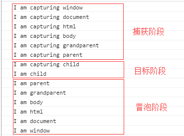

### <span style="color:red;">浅谈js事件流</span>
js里面的事件得三个阶段分别为：捕获、目标、冒泡阶段<br>
1、捕获：事件由页面元素接收，逐级向下，到具体元素的，<br>
2、目标：最具体的元素，<br>
3、冒泡：跟捕获相反，由具体的元素接收，逐级向上，到页面元素

举个例子:

HTML:
```html
<!DOCTYPE html>
<html lang="en">
    <head>  
        <meta charset="UTF-8">
        <title>事件冒泡</title>
        <style type="text/css">
            #child{    
                background: red;
                width:50px;
                height:50px;
            }  
            #father{
                width:100px;
                height:100px;
                background:green;
            }  
            #grandparent{
                width:150px;
                height:150px;
                background:black;
                margin:100px auto 0;
            }  
        </style>
    </head>
    <body>  
        <div id='grandparent'>
            <div id='father'>
                <div id='child'></div>
            </div>  
        </div>
    </body>
    <script type="text/javascript">
        var grandparent = document.getElementById("grandparent"); 
        var parent = document.getElementById("father"); 
        var child = document.getElementById('child');
        var html = document.getElementsByTagName("html")[0];
        var body = document.body; 
        grandparent.addEventListener("click", function () {
            console.log("I am capturing grandparent"); 
        }, true); 
        grandparent.addEventListener("click", function () {
            console.log("I am grandparent"); 
        }, false); 
        parent.addEventListener("click", function() {
            console.log("I am parent"); 
        }, false); 
        parent.addEventListener("click", function() {
            console.log("I am capturing parent"); 
        }, true); 
        child.addEventListener("click", function() {
            console.log("I am capturing child"); 
        }, true); 
        child.addEventListener("click", function() { 
            console.log("I am child"); 
        }, false); 
        body.addEventListener("click", function() { 
            console.log("I am body"); 
        }, false); 
        body.addEventListener("click", function() {
            console.log("I am capturing body"); 
        }, true); 
        html.addEventListener("click", function() {
            console.log("I am capturing html"); 
        }, true); 
        html.addEventListener("click", function() { 
            console.log("I am html"); 
        }, false);
        document.addEventListener("click", function() { 
            console.log("I am capturing document"); 
        }, true); 
        document.addEventListener("click", function() { 
            console.log("I am document"); 
        }, false); 
        window.addEventListener("click", function() { 
            console.log("I am window"); 
        }, false); 
        window.addEventListener("click", function() {
            console.log("I am capturing window");
        }, true);
    </script>
</html>
```

打印出来的结果是这样的：



IE的事件流是采用捕获事件，而DOM的事件流是先捕获后冒泡。

#### javascript事件委托的原理
<b>原理：</b>使用事件委托技术能让你避免对特定的每个阶段添加事件监听器；相反，事件监听器是被添加到它们的父元素上，利用冒泡的原理，把事件加到父级上，触发执行效果。

```html
<!DOCTYPE html>
<html lang="en">
    <head>  
        <meta charset="UTF-8">
        <title>事件委托原理</title>
    </head>
    <body>  
        <ul id="parent-list">
		  	<li id="post-1">Item 1</li>
		  	<li id="post-2">Item 2</li>
		  	<li id="post-3">Item 3</li>
		  	<li id="post-4">Item 4</li>
		  	<li id="post-5">Item 5</li>
		  	<li id="post-6">Item 6</li>
		</ul>
    </body>
    <script type="text/javascript">
        function getEventTarget(e) {
		  var ex = e || window.event;
		  return ex.target || ex.srcElement;
		}
		// 获取父节点，并为它添加一个click事件
		document.getElementById("parent-list").addEventListener("click",function(e) {
		  // 检查事件源e.targe是否为Li
		    var target = getEventTarget(e);

		    if(target && target.nodeName.toUpperCase() == "LI") {
				// 真正的处理过程在这里
				console.log("List item ",e.target.id," was clicked!");
			}
		});
    </script>
</html>
```

<b>优点：</b>
* 可以大量节省内存占用，减少时间注册
* 可以方便地动态添加和修改元素，不需要因为元素的改动而修改事件绑定
* JavaScript和DOM节点之间的关联变少了，这样也减少了因循环引用而带来的内存泄漏发生的概率。

<b>缺点：</b>
不是所有的事件都能冒泡的。blur、focus、load和unload不能像其他时间一样冒泡。事实上blur和focus可以用事件捕获而非事件冒泡的方法获得（在IE之外的其他浏览器中）。在管理鼠标事件得时候有些需要注意的地方。如果你的代码处理mousemove事件得花你遇上性能瓶颈的风险可就大了，因为mousemove事件触发非常频繁。而mouseout则因为其怪异的表现而变得很难用事件代理来管理。